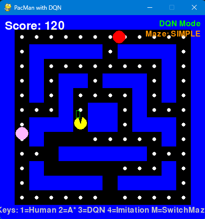

🎮 Enhanced Pac-Man with Deep Reinforcement Learning
A custom Pac-Man environment where a DQN agent learns to master gameplay with dynamic, score-triggered abilities.

 

 

🚀 Project Overview
This project implements a custom Pac-Man environment from scratch using Pygame and integrates it with the Stable Baselines3 library to train a Deep Reinforcement Learning agent. The standard Pac-Man rules are enhanced with a "Super Mode", a powerful combination of skills that activates periodically, creating a dynamic environment where the agent's strategy must constantly adapt.

The goal is to demonstrate that through advanced feature engineering and careful reward shaping, a DQN agent can learn to master complex, non-stationary game mechanics.

✨ Features
Feature

Description

🕹️ Classic Gameplay

Core mechanics including pellet collection and ghost evasion.

🗺️ Two Maze Configurations

A SIMPLE 14x14 maze for rapid prototyping and a COMPLEX 28x31 maze for a harder challenge.

🌟 "Super Mode"

Every 200 points, Pac-Man activates Boost, Invisibility, and Ghost Freeze simultaneously.

🤖 DQN Agent

Implemented using the robust Stable Baselines3 library.

gymnasium Custom Environment

The game is wrapped in a custom environment that follows the Gymnasium (formerly OpenAI Gym) interface.

🧠 Advanced Feature Engineering

A 43-dimensional feature vector provides the agent with rich information, including skill timers and distinct ghost states.

🏆 Tuned Reward Function

A detailed reward shaping mechanism guides the agent to learn complex strategies and avoid common pitfalls.

📊 TensorBoard Integration

For real-time monitoring of training progress and performance metrics.

🛠️ Getting Started
Requirements
Python 3.9+

Pygame

PyTorch

NumPy

Stable-Baselines3 (pip install stable-baselines3[extra])

Gymnasium (pip install gymnasium)

Pandas & Matplotlib (for result analysis)

Installation & Setup
Clone the repository:

git clone <your-repo-url>
cd Enhanced-Pacman-DQN

Install dependencies:

pip install pygame torch numpy "stable-baselines3[extra]" gymnasium pandas matplotlib

🚀 Usage
All primary configurations (training, testing, maze type) are managed via flags at the top of the main.py file.

🧠 Training a New Model
Open main.py and set the flags:

TRAINING_MODE = True
TESTING_MODE = False
MAZE_TYPE = "SIMPLE"  # or "COMPLEX"

Run the script from your terminal:

python main.py

The trained model will be saved in the outputs/models/ directory.

🧪 Testing a Trained Model
Ensure a trained model exists in outputs/models/.

Open main.py and set the flags:

TRAINING_MODE = False
TESTING_MODE = True
TEST_RENDER = True # Set to True to watch the agent play

Run the script:

python main.py

Test results, including a CSV file and summary plots, will be saved in a new timestamped folder inside outputs/test_results/.

📈 Monitoring with TensorBoard
Launch TensorBoard from your terminal:

tensorboard --logdir=./outputs/logs/tensorboard

Open your web browser and navigate to http://localhost:6006.

⌨️ Controls
Key(s)

Action

1

Switch to HUMAN mode (manual control).

2

Switch to A_STAR mode (A* pathfinding AI).

3

Switch to DQN mode (RL agent).

↑↓←→

Move Pac-Man in Human mode.

M

Switch between SIMPLE and COMPLEX maze.

SPACE

Restart the game after a win or loss.

📂 Click to view Project Structure

Enhanced-Pacman-DQN/
├── dqn/              # DQN implementation (environment, training, testing)
├── entities/         # Game entities (Pacman, Ghost)
├── rendering/        # Game rendering utilities
├── utils/            # Helper functions (A* pathfinding, etc.)
├── outputs/          # Saved models, training logs, and test results
│   ├── logs/
│   └── models/
├── images/           # Screenshots for README
├── main.py           # Main game loop and entry point
└── constants.py      # Game constants and maze layouts

👥 Team Members:

Yi Yang

Chenle Wang

Kaiyue Yang
